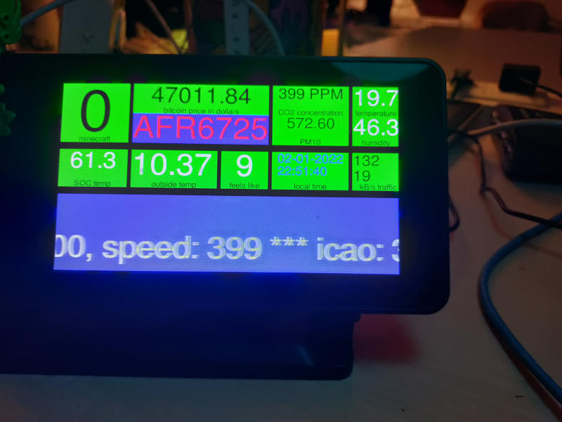

infoviewer
----------

View all kinds of information.
Sources can be mqtt, output from a program (one-shot or tail) and static texts.
Data from sources can be evaluated if it is json.

build
-----

packages required:
* libsdl2-dev
* libsdl2-gfx-dev
* libsdl2-image-dev
* libsdl2-ttf-dev
* libmosquitto-dev
* libconfig++-dev
* libjansson-dev

The example uses fonts from fonts-freefont-ttf

License: CC0

written by folkert van heusden <mail@vanheusden.com>
